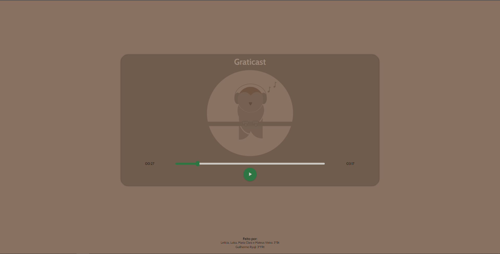

# Trabalho de redação

Site criado para apresentação do trabalho de redação, o qual consiste na produção de um podcast sobre dois ou mais temas excolhidos a partir das ideias de dois ou mais filósofos selecionados pelo grupo.

## Template

## Temas

- Representatividade cultural
- Autoconhecimento

## Filósofos

- Hannah Arendt
- Martin Heidegger